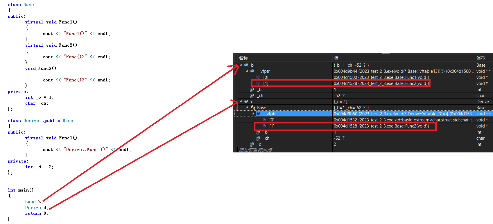

必看
https://zhuanlan.zhihu.com/p/54145222
https://www.cnblogs.com/zkfopen/p/11061414.html
https://blog.csdn.net/cty_xiaobai/article/details/83963094
https://cloud.tencent.com/developer/article/2341658?areaId=106001

# 面向对象语言的三大特性：继承、封装、多态

# 多态

其中多态的含义是同一方法的具体执行与实际调用者上下文环境密切有关。

静态绑定（编译期绑定，早绑定），在编译期间确定了程序的行为，也称为静态多态，比如：函数重载
动态绑定（运行时绑定，晚绑定），是在程序运行期间，判断对象的实际调用的方法。

静态多态：主要通过函数重载与模板实现，其在编译期就可以确定实际的调用地址
动态多态：主要依靠虚函数来实现，不同的编译器其虚函数实现原理不同

# 虚函数

虚函数实现c++的多态性，通过基类的指针指向子类的对象，或者基类的引用绑定子类的对象，来调用子类重写的函数。

# 实现机制 虚函数表vtbl和虚表指针vptr

实现方式是采用**虚函数表vtable，和虚表指针vptr** 。编译器给有虚函数的类增加虚函数表，是个函数查询表，保存每个虚函数的函数指针，函数指针指向的是该类派生最远的函数实现。
如果子类重写了父类的虚函数，子类的虚函数表里就会指向子类的函数实现

虚表指针是类的虚函数表的首地址，放在每个对象的对象模型的头部，对象通过虚表指针和偏移量确定实际调用的虚函数。

每个类使用一个虚函数表，同一个类虚表是共享的.
每个对象（类的实例）有一个虚表指针，指向这个类的虚函数表，当调用虚函数时，通过虚表指针查找虚表，然后调用虚函数。

```cpp
class Base
{
public:
	virtual void Func1()
	{
		cout << "Func1()" << endl;
	}
	virtual void Func2()
	{
		cout << "Func()2" << endl;
	}
	void Func3()
	{
		cout << "Func()3" << endl;
	}
private:
	int _b = 1;
	char _ch;
};

class Derive :public Base
{
public:
	virtual void Func1()
	{
		cout << "Derive::Func1()" << endl;
	}
private:
	int _d = 2;
};


int main()
{
	Base b;
	Derive d;
	return 0;
}
```


派生类对象d中也有一个虚表指针，d对象由两部分构成，一部分是父类继承下来的成员，虚表指针也就是存在部分的另一部分是自己的成员。

基类b对象和派生类d对象虚表是不一样的，这里我们发现Func1()完成了重写，所以d的虚表中存的是重写的Derive::Func1，所以虚函数的重写也叫作覆盖，覆盖就是指虚表中虚函数的覆盖。重写是语法的叫法，覆盖是原理层的叫法。

另外Func2继承下来后是虚函数，所以放进了虚表，Func3也继承下来了，但是不是虚函数，所以不会放进虚表。

总结一下派生类的虚表生成：先将基类中的虚表内容拷贝一份到派生类虚表中,如果派生类重写了基类中某个虚函数，用派生类自己的虚函数覆盖虚表中基类的虚函数,派生类自己新增加的虚函数按其在派生类中的声明次序增加到派生类虚表的最后

# 纯虚函数 和 抽象类

## 1. 纯虚函数

没有具体实现的虚函数，只是声明子类要重写这些纯虚函数
纯虚函数的定义很简单：函数声明后紧跟着=0

## 2. 抽象类

抽象类包含至少一个纯虚函数的类。
抽象类不能实例化对象!
当继承一个抽象类时，必须重写所有纯虚函数，否则继承出来的类也是一个抽象类。
抽象类至少包含一个纯虚函数，抽象类提供了一种禁止其他代码直接实例化对象的方法，但是重写纯虚方法的派生类可以实例化。
如果子类是一个非抽象类的的话，必须重写父抽象类的所有抽象方法，如果子类是一个抽象类的话，可以重写父抽象类的抽象方法，也可以继承父抽象类的抽象方法~

```cpp
class Animal
{
public:
    Animal(const string& name):
        m_name{name}
    {}

    const string& getName() const
    {
        return m_name;
    }

    virtual string speak() const = 0;  // 纯虚函数
    // 因为包含一个纯虚方法，所以是抽象基类

private:
    string m_name;
};

class Cat : public Animal
{
public:
    Cat(const string& name): 
        Animal(name)
    {}

    // 重写了纯虚方法，所以Cat不是抽象类，可以实例化
    virtual string speak() const
    {
        return "Meow";
    }
};

// Dog没有重写基类的纯虚方法，所以仍然无法实例化
class Dog : public Animal
{
public:
    Dog(const string& name):
        Animal(name)
    {}
};

int main()
{
    // Animal animal{"luly"}; // 无法编译，因为抽象基类无法实例化
    Cat cat{ "Sally" };      // 合法
    // Dog dog{ "Betsy" };      // 非法，抽象类无法实例化

    // 下面的代码可以运行，因为可以指向可以实例化的派生类对象
    Animal* aPtr = new Cat{ "Sally" }; 
    cin.ignore(10);
        return 0;
}
```

# override标识符

防止重写失败。告诉编译器这个是重写的函数，如果函数签名不匹配，那么将无法通过编译。

```cpp
class Super
{
public:
    virtual string getName1(int x)
    {
        return "Super";
    }

    virtual string getName2(int x)
    {
        return "Super";
    }
};

class Sub: public Super
{
public:
    virtual string getName1(double x) override
    {
        return "Sub";
    }

    virtual string getName2(int x) const override
    {
        return "Sub";
    }
    // 此时无法编译
};
```

# final标识符

1. 避免子类重写基类的虚函数。使用final标识符，如果子类重写了基类虚函数，那么将无法编译

```
class A
{
public:
    virtual void someMethod() { cout << "A" << endl; }
}

class B: public A
{
public:
    // 基类A的someMethod方法没有final标识符，那么B可以重写该方法
    // 但是此虚方法使用了final标识符，后面的派生类无法重写
    virtual void someMethod() override final { cout << "B" << endl; }
}

class C: public B
{
public:
    // 无法编译，因为不允许重写
    virtual void someMethod() override { cout << "C" << endl; }
}
```

2. final标识符还可以直接用于类，此时该类将不能被继承：

```cpp
class A
{
public:
    virtual void someMethod() { cout << "A" << endl; }
};

// B可以继承A
class B final: public A
{
public:
    virtual void someMethod() override { cout << "B" << endl; }
};

// B无法被继承，此时无法编译
class C: public B
{
public:
    virtual void someMethod() override { cout << "C" << endl; }
};
```

# 析构函数要声明为虚函数

基类的析构函数应该声明为虚函数。
避免内存泄漏。如果没有声明为虚函数，删除基类指向子类对象的指针，不会调用子类的析构函数和子类数据成员的析构函数，造成内存泄漏。

基类的析构函数声明为虚函数以后，会按指向类型进行析构，也就是子类。然后析构子类的话会默认析构父类。delete时子类父类都能被释放。

所以不加virtual可能会存在内存泄露的问题

```cpp

class Resource
{
public:
    Resource() { cout << "Resource created!" << endl; }
    ~Resource() { cout << "Resource destoryed!" << endl; }
};

class Super
{
public:
    Super() { cout << "Super constructor called!" << endl; }
    ~Super() { cout << "Super destructor called!" << endl; }
};

class Sub : public Super
{
public:
    Sub() { cout << "Sub constructor called!" << endl;}

    ~Sub() { cout << "Sub destructor called!" << endl；}
private:
    Resource res;
};
```

如果执行下面的代码：

```cpp
int main()
{
    Sub* sub = new Sub;
    Super* super = sub;
    delete super;

    cin.ignore(10);
        return 0;
}
```

其输出为：

```
Super constructor called!
Resource created!
Sub constructor called!
Super destructor called!
```

可以看到，派生类的析构函数没有执行，其数据成员Resource也没有被析构。但是如果你将析构函数都声明为虚函数，上面的代码将得到如下的结果：

```
Super constructor called!
Resource created!
Sub constructor called!
Resource destoryed!
Sub destructor called!
Super destructor called!
```

# 虚函数性能开销

https://zhuanlan.zhihu.com/p/40546963

# 面试问题

## 1. 空类构成的继承层次中，每个类的大小是多少？

https://zhuanlan.zhihu.com/p/596288935

## 2. 虚函数表放置在内存布局中的那个区域？

虚函数表的内容是在编译时确定的。编译期间编译器就为每个类确定好了对应的虚函数表里的内容。 在程序运行时，编译器会把虚函数表的首地址赋值给虚函数表指针。
每个类拥有一个虚函数表，每个类的对象中的虚函数表指针所指向的都是同一个虚函数表。
虚函数表的内容是固定不变的，因此它会存放在常量区。

## 3. 虚函数表指针在什么时候创建？

对象构造时。类的构造函数中会首先执行vptr的初始化然后再执行其他的。

## 友元函数可以是虚函数吗？

友元不可以为虚函数
   友元不是成员函数，是类外函数


二，哪些函数不能成为虚函数？

1.内联函数：我们都知道内联函数只是在函数调用点将其展开，它不能产生函数符号，所以不能往虚表中存放，自然就不能成为虚函数。

2.静态函数：定义为静态函数的函数，这个函数只和类有关系，它不完全依赖于对象调用，所以也不能成为虚函数。

3.构造函数：都知道只有当调用了构造函数，这个对象才能产生，如果把构造函数写成虚函数，这时候我们的对象就没有办法生成。更别说用对象去调用了。所以构造函数不能成为虚函数。

4.友元函数：友元函数不属于类的成员函数，不能被继承。对于没有继承特性的函数没有虚函数的说法。

5.普通函数：普通函数不属于成员函数，是不能被继承的。普通函数只能被重载，不能被重写，因此声明为虚函数没有意义。因为编译器会在编译时绑定函数。


## 1.inline函数可以是虚函数吗？

 是可以编译通过的，因为编译器忽略了inline属性，这个函数就不在是内联函数了，因为虚函数地址要放到虚表中去
 inline函数是在调用的地方进行展开，但是虚函数是要放到虚表中去的，这就矛盾了，因为inline函数没有地址，无法把地址放到虚函数表中，所以总结就是对于多态调用没有inline属性，普通调用可以继续保持inline属性

## 2.静态成员可以是虚函数吗？

 不能，因为静态成员函数没有this指针，使用类型::成员函数的调用方式无法访问虚函数表，所以静态成员函数无法放进虚函数表。

## 3.构造函数可以是虚函数吗？

 不能，因为对象中的虚表指针是在构造函数初始化列表阶段才初始化的。

如果构造函数是虚函数，那么调用构造函数就需要去找vptr虚表指针，而此时vptr虚表指针还没有初始化。

vptr的初始化：当对象在创建时，由编译器对vptr指针进行初始化。在定义子类对象时，vptr先指向父类的虚函数表，在父类构造完成之后，子类的vptr才指向自己的虚函数表。

## 4.对象访问普通函数快还是虚函数更快？

 对于普通对象，是一样快的。如果是指针对象或者是引用对象，则调用的普通函数快，因为构成多态，运行时调用虚函数需要到虚函数表中去查找。

## 5.虚函数表是在什么阶段生成的，存在哪的？

 虚函数表是在编译阶段就生成的，在构造函数初始化列表中初始化虚表指针，一般情况下存在代码段(常量区)的。

## 6.不要把虚函数表和虚基表搞混了：在多态中，虚函数表是存放虚函数的地址。在继承中，虚基表存储偏移量，解决菱形继承中的代码冗余与二义性

## 7.抽象类强制重写了虚函数，另外抽象类体现出了接口继承关系

# 使用虚函数后的变化：

（1） 对象将增加一个存储地址的空间（32位系统为4字节，64位为8字节）。
（2） 每个类编译器都创建一个虚函数地址表
（3） 对每个函数调用都需要增加在表中查找地址的操作。

# 虚函数的注意事项

（1） 基类方法中声明了方法为虚后，该方法在基类派生类中是虚的。
（2） 若使用指向对象的引用或指针调用虚方法，程序将根据对象类型来调用方法，而不是指针的类型。
（3）如果定义的类被用作基类，则应将那些要在派生类中重新定义的类方法声明为虚。
构造函数不能为虚函数。
基类的析构函数应该为虚函数。
友元函数不能为虚，因为友元函数不是类成员，只有类成员才能是虚函数。
如果派生类没有重定义函数，则会使用基类版本。
重新定义继承的方法若和基类的方法不同（协变除外），会将基类方法隐藏；如果基类声明方法被重载，则派生类也需要对重载的方法重新定义，否则调用的还是基类的方法。
