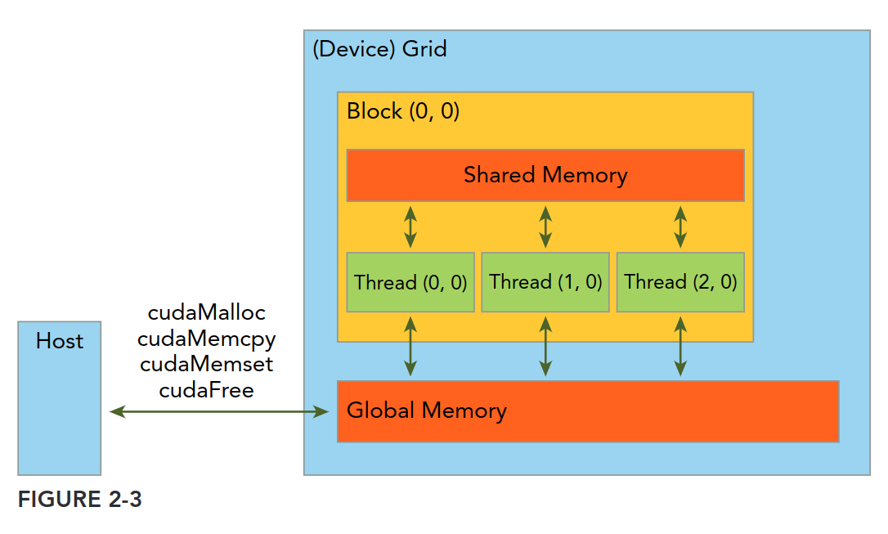

CUDA 笔记
https://zhuanlan.zhihu.com/p/454319729

# 01
## 一个CUDA的程序主要流程如下：
1、分配GPU内存。
2、将数据从CPU复制到GPU中。
3、调用CUDA核执行相关数据。
4、将结果从GPU复制到CPU中。
5、释放GPU内存。

```CPP
#include <iostream>

__global__ void fun() {
    printf("hello world from GPU\n");
}

int main() {
    printf("hello world from CPU\n");

    // fun<<< m,n >>>()：代表一个kernel被调用的固定格式。m,n分别代表块和线程数。后续文章会进行介绍。
    fun<<<2, 3>>>();
    cudaDeviceSynchronize();
}
```
## 1. __global__
__global__:声明一个函数作为kernel
1、在设备上执行
2、仅在主机上调用

## 2. cudaDeviceSynchronize 
使CPU进程等待GPU上的进程执行完毕。
注：在host code中执行device code，CPU会在执行一个kernel后，立刻执行后续操作，相当于形成两个分支，而不会等待GPU上的进程是否完成。

## 3. fun<<< m,n >>>()
代表一个kernel被调用的固定格式。m,n分别代表块和线程数。

# 02
## kernel 函数
kernel是CUDA程序的重要组件，表示在GPU设备中运行的代码（它是程序，是代码，不是代表芯片上的物理核心！）。
当一个kernel启动后，控制权会立刻返回至host上，即当程序执行到一个kernel代码后，主程序会继续向下执行，与kernel函数此时是否执行完毕无关。

一个kernel --> 一个grid --> 多个block --> 多个thread；

不同block中的thread不能通信（不能越级！！）。

CUDA编程模型将GPU的内存架构抽象为两个主要的层次：
1、global memory：类似CPU的系统内存
2、shared memory：类似CPU的缓存

|CPU|GPU|
|---|---|
|malloc|cudaMalloc|
|free|cudaFree|
|memcpy|cudaMemcpy|
|memset|cudaMemset|



cudaMemcpy函数会引起CPU程序阻塞，即只有当这个操作完成后，CPU才可以执行后续代码。